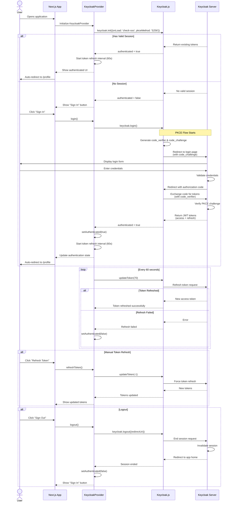

# MPC MVP - Frontend (CSR)

Multi-Party Computation MVP frontend with Client-Side Rendering, built with Next.js 15 and Keycloak authentication.

## Tech Stack

- **Next.js 15.5.9** with Turbopack
- **React 19.1.0**
- **TypeScript 5**
- **Tailwind CSS 4** (with `@tailwindcss/postcss` plugin)
- **Keycloak.js 26.2.2** for authentication
- **pnpm** as package manager

## Getting Started

### Prerequisites

- Node.js 18+
- pnpm (install with `npm install -g pnpm`)
- Keycloak server (local or remote)

### Installation

1. Clone the repository
2. Install dependencies:
   ```bash
   pnpm install
   ```

3. Configure Keycloak:
   ```bash
   cp .env.example .env.local
   ```

4. Edit `.env.local` with your Keycloak settings:
   ```env
   NEXT_PUBLIC_KEYCLOAK_URL=http://localhost:8080
   NEXT_PUBLIC_KEYCLOAK_REALM=master
   NEXT_PUBLIC_KEYCLOAK_CLIENT_ID=mpc-mvp-client
   ```

### Development

Run the development server:

```bash
pnpm dev
```

Open [http://localhost:3000](http://localhost:3000) with your browser to see the result.

### Build

Build for production:

```bash
pnpm build
```

Start production server:

```bash
pnpm start
```

### Linting

Run ESLint:

```bash
pnpm lint
```

## Features

### Authentication (Keycloak)

- **Single Sign-On (SSO)** - Integrated with Keycloak identity provider
- **JWT Token Management** - View access and refresh tokens
- **Automatic Token Refresh** - Tokens refresh every 60 seconds
- **Protected Routes** - Profile page requires authentication
- **Token Expiration Countdown** - Real-time countdown timers showing when tokens expire
- **PKCE Security** - Implements Proof Key for Code Exchange for enhanced security

### Routes

- `/` - Home page with authentication status
  - **Unauthenticated users**: Shows "Sign In" button (redirects to Keycloak login)
  - **Authenticated users**: Shows "View Profile" and "Sign Out" buttons, auto-redirects to `/profile`
- `/profile` - User profile page (protected, requires authentication)
  - Displays raw JWT tokens (access & refresh)
  - Shows decoded token information with syntax highlighting
  - Real-time expiration countdown for both tokens
  - Highlighted `exp` field with human-readable timestamps
  - Manual token refresh button
  - Logout button (redirects to home page after logout)

### Profile Page Features

The profile page (`/profile`) provides comprehensive token information:

1. **Token Display**
   - Raw JWT tokens (both access and refresh)
   - Decoded token payloads in formatted JSON

2. **Expiration Tracking**
   - Live countdown timer showing time until expiration
   - Color-coded status:
     - 🟢 Green: Token valid (>5 minutes remaining)
     - 🟠 Orange: Expiring soon (≤5 minutes remaining)
     - 🔴 Red: Expired
   - Highlighted `exp` field with Unix timestamp and readable date

3. **Token Management**
   - Refresh Token button - manually refresh tokens
   - Logout button - sign out and clear session

## Project Structure

```
src/
  app/                    # Next.js App Router
    page.tsx              # Home page with sign in/out buttons
    layout.tsx            # Root layout with Keycloak provider
    globals.css           # Global styles
    profile/              # User profile (protected)
      page.tsx
  contexts/               # React contexts
    KeycloakContext.tsx   # Authentication context provider
  lib/                    # Utilities
    keycloak.ts           # Keycloak configuration
public/                   # Static assets
```

## Configuration

### Environment Variables

Required environment variables (set in `.env.local`):

| Variable | Description | Example |
|----------|-------------|---------|
| `NEXT_PUBLIC_KEYCLOAK_URL` | Keycloak server URL | `http://localhost:8080` |
| `NEXT_PUBLIC_KEYCLOAK_REALM` | Keycloak realm name | `master` |
| `NEXT_PUBLIC_KEYCLOAK_CLIENT_ID` | Client ID for this app | `mpc-mvp-client` |

### Keycloak Client Configuration

Ensure your Keycloak client is configured with:
- **Access Type**: `public`
- **Standard Flow Enabled**: `ON`
- **Valid Redirect URIs**: `http://localhost:3000/*`
- **Web Origins**: `http://localhost:3000`

## Development Notes

### Path Aliases

- `@/*` maps to `./src/*`
- Use this for all internal imports

### Tailwind CSS 4

This project uses Tailwind CSS v4:
- No `tailwind.config.ts` file
- Configuration via `@theme` directive in CSS files
- Uses CSS variables for theming

### Turbopack

All commands use Turbopack (Next.js's Rust-based bundler) for faster builds and hot reloading.

## Authentication Flow

### Sign-In Flow Diagram

The following diagram illustrates the complete authentication flow using Keycloak with PKCE (Proof Key for Code Exchange):



### Key Security Features

1. **PKCE (Proof Key for Code Exchange)**
   - Uses SHA-256 hashing (`pkceMethod: 'S256'`)
   - Protects against authorization code interception attacks
   - Code verifier generated client-side, code challenge sent to server

2. **Automatic Token Refresh**
   - Tokens refreshed every 60 seconds
   - Refresh triggered when token has less than 70 seconds remaining
   - Automatic logout on refresh failure

3. **SSO (Single Sign-On)**
   - `check-sso` mode checks for existing sessions without forcing login
   - Seamless authentication if user is already logged in to Keycloak

4. **JWT Token Management**
   - Access token for API authorization
   - Refresh token for obtaining new access tokens
   - Tokens stored client-side by Keycloak.js

## Learn More

- [Next.js Documentation](https://nextjs.org/docs)
- [Keycloak Documentation](https://www.keycloak.org/documentation)
- [Keycloak.js Documentation](https://github.com/keycloak/keycloak-js)
- [Tailwind CSS v4](https://tailwindcss.com/docs)

## License

MIT
